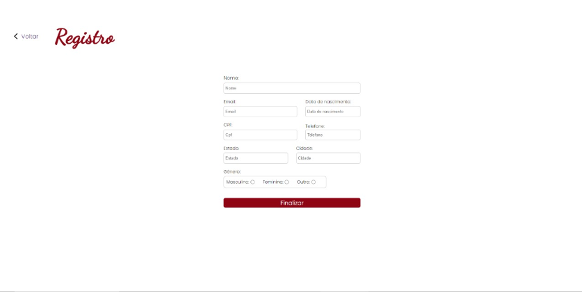
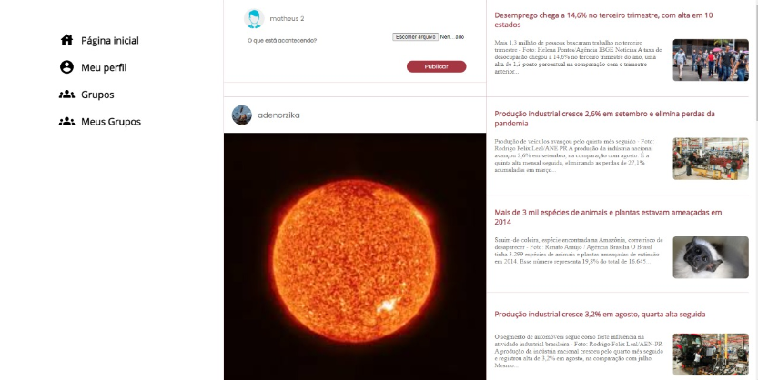

<h1 align="center">

 
Social Media
</h1>

Uma rede social para o compartilhamento de fotos
 <br/

# 📋 Índice

- [Telas](#-Telas)
- [Sobre o projeto](#-Sobre-o-projeto)

## 🎨 Telas

 
 

## 📃 Sobre o projeto

Projeto desenvolvido para máteria de Desenvolvimento de sistemas microsoft, foi utilizado ASP .NET CORE MVC com Entity framework core.
